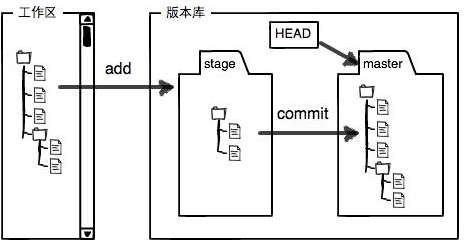

## Terminal 操作命令
1. dir 展示当前文件夹下的所有文件
2. cls 清空  不然就 clear / reset
3. path 查看当前运行环境的环境变量
4. mkdir 创建文件夹

## Git 操作命令

### git 流程

工作区有一个隐藏目录.git，这个不算工作区，而是Git的版本库。
Git的版本库里存了很多东西，其中最重要的就是称为stage（或者叫index）的暂存区，还有Git为我们自动创建的第一个分支master，以及指向master的一个指针叫HEAD。

### 看当前目录下所有可见文件
>ls   或者  ls -l 查看详细属性

### 查看文件具体内容
>cat  fileName

### 修改文件
>vi 修改文件  使用insert 可以修改文件，修改之后按ese键进入命令模式  ：w 保存文件   ：wq保存修改并退出vi  :q!放弃修改vi并退出

### 查看git的提交记录  
1. git log
2. git log  --pretty=oneline --abbrev-commit
3. https://blog.csdn.net/helloxiaozhe/article/details/80563427  详细的提交历史

### 记录自己的所有git 命令
>git reflog

### 创建版本库  
>git init  会生成 .git 文件

### 提交文件到版本库  
>git add  fileName 或者 git add .

### 修改文件 
>git commit -m "提交文件的描述"  （描述一定要详细...）

### 回退版本  
1. git reset --hard  HEAD^ （回退一个版本^ 多个的话 HEAD~n） 
2. git reset --hard commit_id ( 通过git log / reflog 查看id) 

### 标识工作区的文件
>git status 

### 查看工作区和版本库里面最新版本的区别
>git diff HEAD --  fileName

### 撤销工作区的修改内容
1. git checkout -- fileName
2. 当工作区的文件rm -rf 删除之后通过以上命令可以还原

### 删除本地文件
1. rm -rf  * 删除当前目录下所有文件
2. rm -r     删除列出来的所有目录 
3. f 不进行提示直接删除 (只是删除工作区的文件)

### 删除版本库文件
>git rm fileName  

### 删除版本库文件夹
>git rm -r folder  

### 将本地文件推送到github上
1. git remote add origin git仓库地址
2. git push -u origin master（第一次得写全） 以后可以直接git push 
3. fatal: Could not read from remote repository.的解决办法
4. https://blog.csdn.net/Leolu007/article/details/79129446
5. https://blog.csdn.net/shog808/article/details/76563136

### git分支问题
1. git branch     创建分支
2. git checkout  切换分支
3. git checkout -b 创建并切换分支
4. git branch -d  删除分支
5. git branch -D  删除未合并过的分支
6. git merge  合并分支
7. git rebase 合并分支

### 推送分支
1. git push origin branch  推送本地分支到远程
2. git checkout branch  
3. git checkout -b branch origin/branch    获取远程分支
4. git branch -r 查看远程的所有分支
5. git push origin branch:branch 创建远程分支
6. git push --set-upstream  origin branch  关联本地与远程的分支
7. git push origin --delete branch 删除远程分支

### git stash
1. git stash  隐藏工作区修改的内容
2. git stash apply  显示隐藏的内容
3. git stash drop    删除之前隐藏的内容
4. git stash pop     显示并删除

### 查看远程仓库信息
1. git remote  仓库名 默认origin
2. git remote -v  详细信息
 
### 可以给当前分支最新代码打上标签
>git tag 标签  

### 给只定的提交记录打上标签
>git tag id

### 展示提交的具体内容
>git show 标签  

### 给标签写上具体的描述
>git tag -a  标签  -m ""  commit id

### 推送本地标签
1. git push origin --tags
2. git push origin v1.0

### 配置别名
>git config --global alias.st status

### git rebase
>http://gitbook.liuhui998.com/4_2.html
