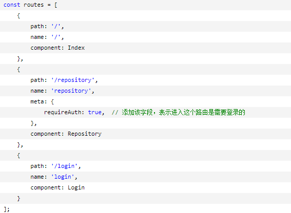
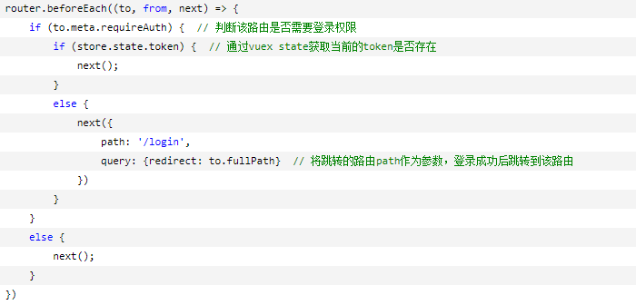

>对于一些页面的访问权限配置,可在const.js中配置黑名单与白名单,通过在导航守卫中获取`to`,`form`等一些信息,从而对页面权限进行设置

## post与get请求方式的差异
参数的传递方式不一样,get请求的入参是{params:{}},post请求的入参是{data:{}},post的请求的data可以省略,而params不能
```
axios.get('/user', {params: {ID: 12345}})
  .then(function (response) {
    console.log(response);
  })
  .catch(function (error) {
    console.log(error);
  });
```

```
axios.post('/user',{ID: 12345})
  .then(function (response) {
    console.log(response);
  })
  .catch(function (error) {
    console.log(error);
  });
```

## 实现一些拦截的操作

### 路由上的拦截

- 可以再路由上写上自定义的参数,通过在导航守卫中对参数的判断来实现是否需要拦截以及其它的操作



### axios拦截

1. 请求拦截器
```
axios.interceptors.request.use(
    config => {
        可以对axios中get或者post请求的请求头做一些配置
    },
    err => {
        return Promise.reject(err);
    });

```
2. 响应拦截器
```
axios.interceptors.response.use(
    response => {
        return response;
    },
    error => {
        if (error.response) {
            switch (error.response.status) {
                case 401:
                    // 返回 401 清除token信息并跳转到登录页面
                    store.commit(types.LOGOUT);
                    router.replace({
                        path: 'login',
                        query: {redirect: router.currentRoute.fullPath}
                    })
            }
        }
        return Promise.reject(error.response.data)   // 返回接口返回的错误信息
    });
```


