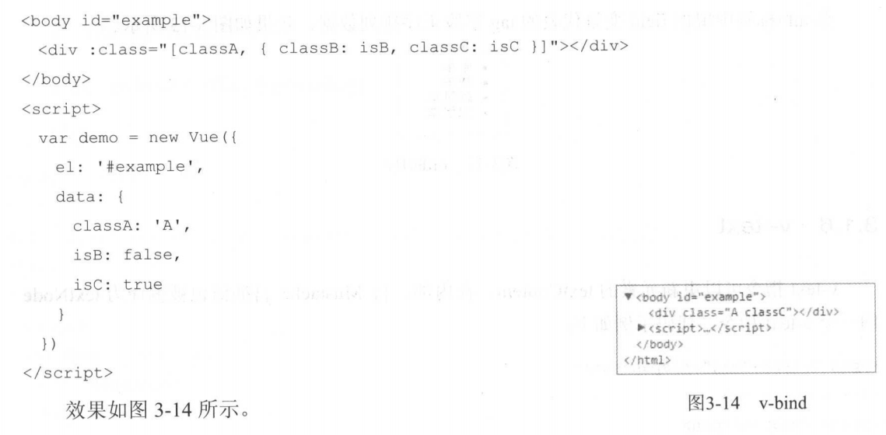
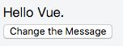
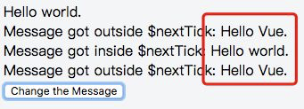
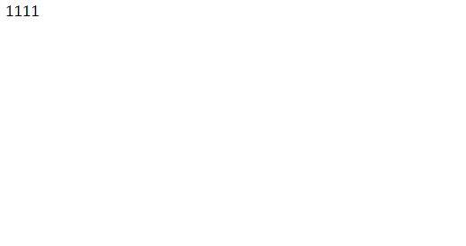

vue 权威指南
>链接: https://pan.baidu.com/s/1WCUp2lz1bUc-oTiohUFHPw 提取码: 9b8u


## vue如何动态绑定图片
- 图片的绑定需要使用v-bind:src
- 在data中用require("")引入图片路径
- 把图片放在static中

## 三种前端架构模式
1. mvvm  model（模型）-viewModel（）-view（视图）
>viewModel 实现了observe（类似观察者模式）
2. mvc  
3. mvp

## v-model修饰符
1. lazy 只有文本框的on-change触发后值才会发生改变
2. number 将输入的值转为number类型
3. trim 去掉输入的字符串后的空格


> 使用`v-for`的时候必须绑定一个`key`,不然控制台会抛警告

> 我们应当尽量避免给已经`v-model`的数组赋值，如果需要赋值的话，请使用`$set`

## vue绑定class
```
HTML代码：
<div :class="{ 'class-a': isA, 'class-b': isB}">Demo4</div>

Javascript代码：
data: {
  isA: false,  //当isA改变时，将更新class
  isB: true    //当isB改变时，将更新class
}
渲染后的HTML:
<div class="class-b">Demo4</div>

```

```
HTML代码：
<div :class="objectClass">Demo5</div>

Javascript代码：
data: {
  objectClass: {
    class-a: true,
    class-b: false
  }
}

渲染后的HTML:
<div class="class-a">Demo5</div>

```
```
HTML代码：
<div :class="[classA, classB]">Demo6</div>

Javascript代码：
data: {
  classA: 'class-a',
  classB: 'class-b'
}

渲染后的HTML:
<div class="class-a class-b">Demo6</div>

```



## vue绑定style
```
<div :style="{ fontSize: size + 'px' }"></div>

```

## sync修饰符
1. 在父组件使用sync绑定一个值 `:modelVal.sync="tree.val1"`
2. 在子组件data中定义一个realVal,`realVal:this.modelVal`
3. 子组件绑定realVal
4. 使用watch监听realVal
```
realVal(newVal,oldVal){
    this.$emit("update:modelVal",newVal)
}
```
## prop

1. 校验
```
propF: {
      validator: function (value) {
        // 这个值必须匹配下列字符串中的一个
        return ['success', 'warning', 'danger'].indexOf(value) !== -1
      }
    }
```
2. 给对象或数组赋默认值
```
propE: {
      type: Object,
      // 对象或数组默认值必须从一个工厂函数获取
      default: function () {
        return { message: 'hello' }
      }
    }
```

## 作用域插槽的使用方法

>写组件的时候要多用插槽slot

>在自组件里面使用`slot`并在`slot`标签上绑定属性，在父组件中使用`slot-scope`可以获取子组件上`slot`绑定的数据

```
<!DOCTYPE html>
<html lang="en">
<head>
    <meta charset="UTF-8">
    <title>Document</title>
    <script src="https://unpkg.com/vue/dist/vue.js"></script>
</head>
<body>
    <div id="example">
        <child :list="list">
                <template slot-scope="item">
                    <div v-if="item.item.id===1">{{item.item.id}} </div>
                    <div v-else>{{item.item.name}} </div>
                </template>
        </child>      
    </div>
    <script>
        Vue.component('child',{
            props:['list'],
            template:`
                <div>
                    <ul>
                        <li v-for="(item,index) in list" :key="index">
                            <slot :item="item">
                            
                            </slot>
                        </li>
                    </ul>
                </div>
            `
        })
        var vm = new Vue({
            el: '#example',
            data: {
                list:[
                    {id:1,name:11},
                    {id:2,name:22},
                    {id:3,name:33},
                    {id:4,name:44}
                ]
            }
        })
    </script>
</body>
</html>

```

## this.$nextTick
- 在vue中DOM的更新是异步的
- 在Vue生命周期的created()钩子函数进行的DOM操作一定要放在Vue.nextTick()的回调函数中
- 在数据变化后要执行的某个操作，而这个操作需要使用随数据改变而改变的DOM结构的时候，这个操作都应该放进Vue.nextTick()的回调函数中。

模板
```
<div class="app">
  <div ref="msgDiv">{{msg}}</div>
  <div v-if="msg1">Message got outside $nextTick: {{msg1}}</div>
  <div v-if="msg2">Message got inside $nextTick: {{msg2}}</div>
  <div v-if="msg3">Message got outside $nextTick: {{msg3}}</div>
  <button @click="changeMsg">
    Change the Message
  </button>
</div>
```
vue实例
```
new Vue({
  el: '.app',
  data: {
    msg: 'Hello Vue.',
    msg1: '',
    msg2: '',
    msg3: ''
  },
  methods: {
    changeMsg() {
      this.msg = "Hello world."
      this.msg1 = this.$refs.msgDiv.innerHTML
      this.$nextTick(() => {
        this.msg2 = this.$refs.msgDiv.innerHTML
      })
      this.msg3 = this.$refs.msgDiv.innerHTML
    }
  }
})
```
点击前


点击后



## this,ref,$root,$parent

1. `this` 当前页面的实例

2. `this.$root` 页面的根实例 

3. `this.$parent` 获取父组件的实例

4. 给当前组件加上`ref`属性,通过`this.$refs['ref']`可以获取组件的实例

## 依赖注入
父组件
```
provide: function () {
  return {
    getMap: this.getMap
  }
}
```
子组件
```
inject['getMap']

```
>这样这个父组件的`所有后代组件`都可以访问父组件的`getMap`方法

## 混入mixins
可以写一个通用的js文件,import引入之后可以通过mixins混入当前页面,会和当前页面的一些方法属性融合

## 组件间的数据传递
1. 父->子  `props`
2. 子->父  `子组件$emit(eventName,params) 父组件$on(eventName)`
3. 兄弟组件之间 `创建一个公共的Bus=new Vue() ,Bus.$on(eventName,eventHandler)抛出事件 Bus.$emit(eventName)触发事件` 
4. 停止监听事件 `$off(eventName,eventHandler)`

## vue生命周期
1. beforeCreate
>`el`没有挂载,`data`还没有生成
2. created
>`el`没有挂载,`data`已经生成
3. beforeMount
>`el`已经被挂载,`data`已经生成,数据没有被渲染
4. mounted
>数据开始被渲染
5. beforeUpdated
>组件更新之前的状态
6. update
>组件更新之后的状态
7. beforeDestroy

8. destroyed
    1. 页面切换时组件会自动被销毁,组件被销毁之后会触发
    2. Vue 实例销毁后调用。调用后，Vue 实例指示的所有东西都会`解绑定`，所有的事件监听器会被移除，所有的子实例也会被销毁。 该钩子在服务器端渲染期间不被调用。
    3. 此时修改实例中的内容`Dom`不会发生任何改变

9. vue没有挂载el上的时候可以使用$mount()挂载

## 定义模板的方式
1. 内联模板
>写在组件上的属性,会弃用子组件的内容而选择父组件所包含的内容

```
<!DOCTYPE html>
<html lang="en">
<head>
    <meta charset="UTF-8">
    <title>Document</title>
    <script src="https://unpkg.com/vue/dist/vue.js"></script>
</head>
<body>
    <div id="example" >
        <child :list="list" inline-template>
              <div>1111</div>
        </child>      
    </div>
    <script>
        Vue.component('child',{
            props:['list'],
            template:`
                <div>
                    <ul>
                        <li v-for="(item,index) in list" :key="index">
                            {{item.name}}
                        </li>
                    </ul>
                </div>
            `
        })
        var vm = new Vue({
            el: '#example',
            data: {
                list:[
                    {id:1,name:11},
                    {id:2,name:22},
                    {id:3,name:33},
                    {id:4,name:44}
                ]
            }
        })
    </script>
</body>
</html>
```
2. X--Templates
>另一个定义模板的方式是在一个 `<script>` 元素中，并为其带上` text/x-template `的类型，然后通过一个 id 将模板引用过去。例如：

```
<script type="text/x-template" id="hello-world-template">
  <p>Hello hello hello</p>
</script>
```

```
Vue.component('hello-world', {
  template: '#hello-world-template'
})
```

## 强制更新 $forceUpdate()